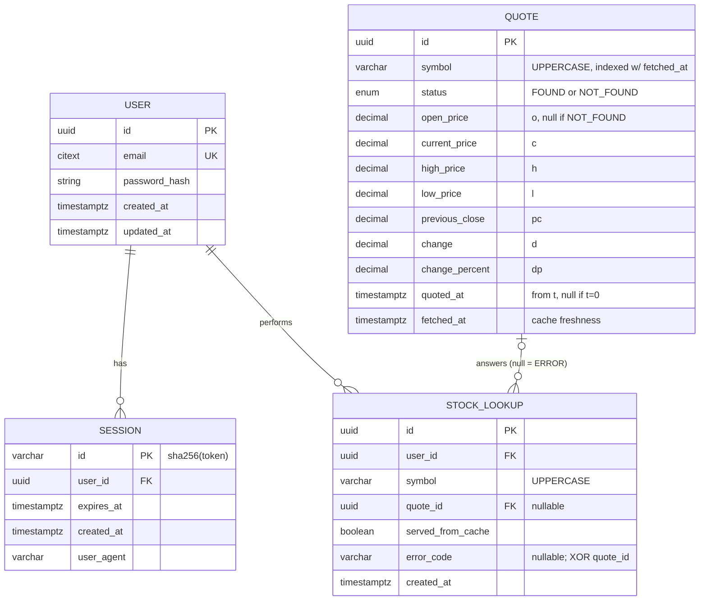

# Data Model

PostgreSQL (Neon) via Prisma. `quotes` is an append-only log of Finnhub `/quote` calls that doubles as the cache; `stock_lookups` is one row per user search, pointing at the quote that answered it.

## Relationships

- **User → Session** (1 to 0..N): cascade on delete.
- **User → StockLookup** (1 to 0..N): cascade on delete.
- **Quote → StockLookup** (0..1 to 0..N): many lookups can share one cached quote; `quote_id` is null when the lookup errored. Restrict on delete, so pruning the cache never erases history.